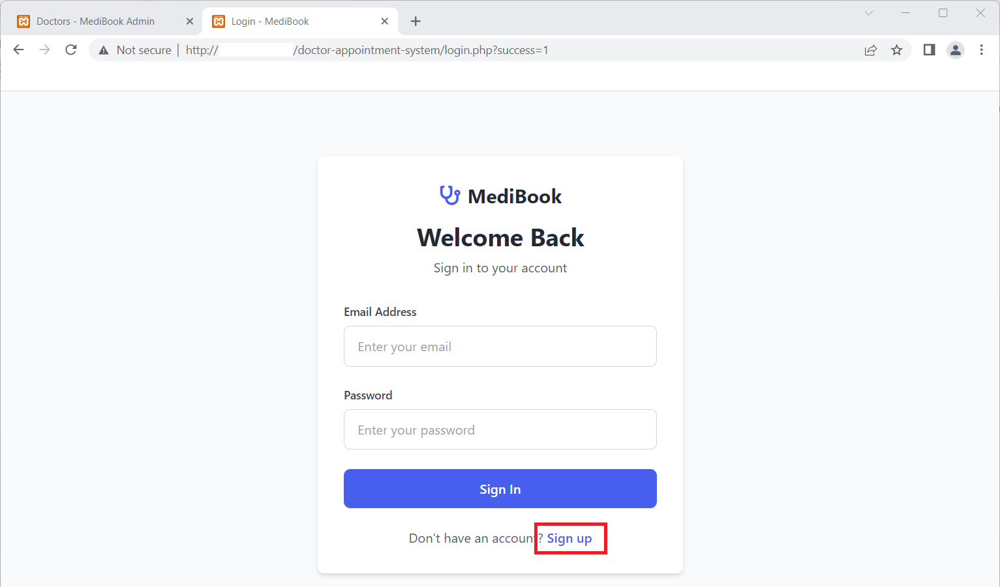
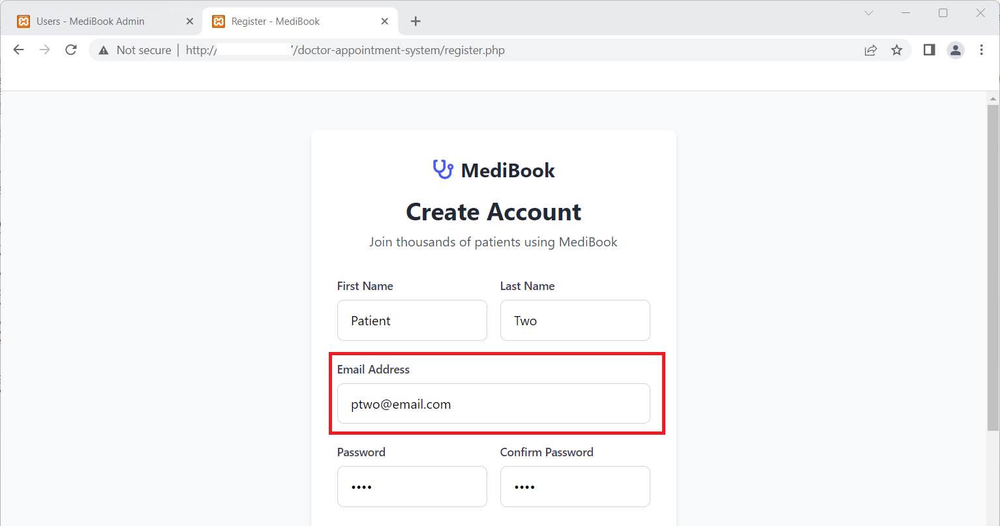
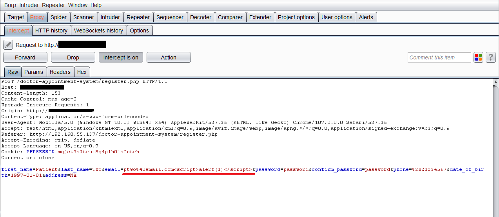
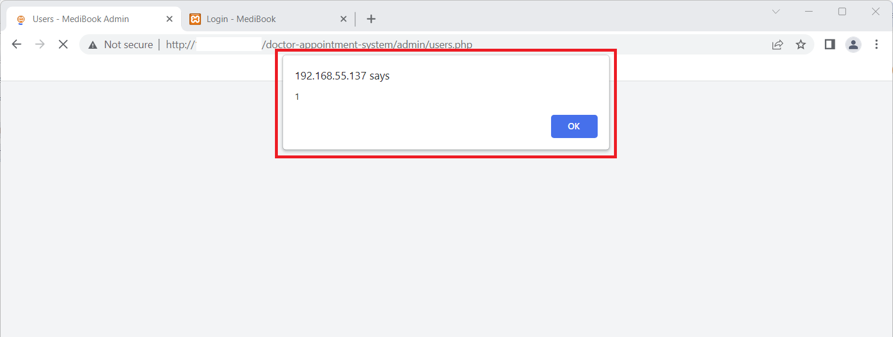
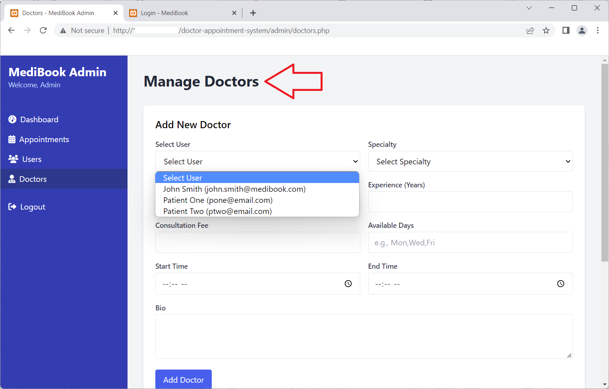

## Title: Cross Site Scripting (Stored) Vulnerability in Doctor Appointment System

**BUG_Author:** Lo Wai Man

**Affected Version:** Doctor Appointment System

**Vendor:** [SourceCodester](https://www.sourcecodester.com)

**Software:** [Doctor Appointment System](https://www.sourcecodester.com/php/18453/doctor-appointment-system-using-php-and-mysql-source-code.html)

**Vulnerability Files:**
- `/doctor-appointment-system/register.php`
- `/doctor-appointment-system/admin/users.php`
- `/doctor-appointment-system/admin/doctors.php`

## Description:

1. **Cross Site Scripting (Stored) via Sign up page:**
   - In the file `/doctor-appointment-system/register.php`, the Patients can sign up as users. This page does not properly implement input validation in server side which only enforce in the client side.
   - It can be bypass the client side security controls and stored a malicious javascript to the email input field.

2. **Exploiting the Cross Site Scriptiing (Stored):**
   - By storing malicious javascript into the email field, an attacker can obtain the admin cookie value once the admin accessing to the user management page.

3. **Example Cross Site Scripting Payload:**
   - The following payload can be used to malicious Javascript code:
     ```
     Email: ptwo%40email.com<script>alert(1)</script>
     ```

4. **Requesting the Sign up page:**
   - Make a request to sign up as Patients in Sign up page:
     ```
     http://localhost/doctor-appointment-system/login.php
     ```
   
   - This vulnerablility is in Manage Users page via Admin privilege.
     ```
     http://localhost/doctor-appointment-system/admin/users.php
     ``` 
     ```
     http://localhost/doctor-appointment-system/admin/doctors.php
     ``` 

5. **Verifying the Exploit:**
   - If the cross site scripting is successful, the attacker can access the malicious Javascript coding at the victim web browser. (i.e stolen admini privilege cookie)

## Proof of Concept:

1. Access Sign up page in vulnerable application:
   ```
   http://localhost/doctor-appointment-system/login.php
   ```
   

2. Enter the request information to register as Patient user
   ```
   http://localhost/doctor-appointment-system/register.php
   ```
   

3. Intercept the HTTP request and manipluate parameter of email with malicious Javascript coding:

   
   
4. Login to the application with Admin privilege and access Manage Users page that trigger the malicious Javascript coding due to retrieve the user details of email:
   ```
   http://localhost/doctor-appointment-system/admin/users.php
   ``` 
   
   
   

5. Access Manage Doctors page that trigger the malicious Javascript coding due to retrieve the user details of email:
   ```
   http://localhost/doctor-appointment-system/admin/doctors.php
   ``` 

   

   
  
## Recommendations:

It is recommended to implement proper input validation and output encoding based on context (HTML, JavaScript, URL, etc.). Use secure development frameworks that automatically escape user input.
